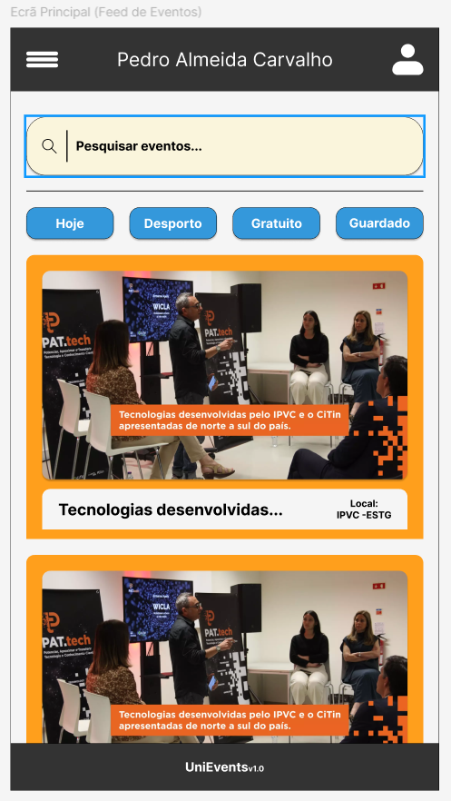
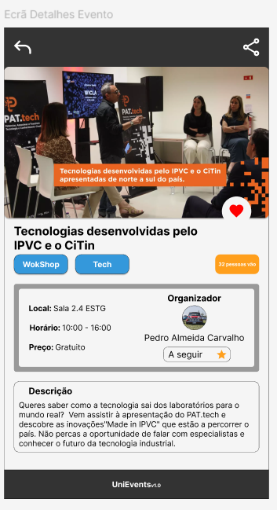

# Fase 1: Definição do Tema e Recolha de Requisitos

| Campo | Informação |
| :--- | :--- |
| **Nome provisório** | UniEvents |
| **Tema** | Agenda Social Colaborativa Académica |
| **Membros do grupo** | Pedro Almeida Carvalho, Nº 29268; Gonçalo Marques, Nº29198|
| **Curso / Turma** | Engenharia Informática / Turma A,D |
| **Data e versão** | 19/11/2025 - v1.0 |

## 1. Contexto e Motivação
**Problema:**
A divulgação de eventos do IPVC (palestras, workshops, festas, atividades de núcleos) encontra-se dispersa entre cartazes físicos, emails institucionais (que ninguém lê) e redes sociais pessoais. Isto dificulta o acesso à informação e reduz a adesão dos estudantes.

**Relevância:**
A centralização desta informação numa plataforma colaborativa é relevante para a comunidade escolar pois fomenta a participação, facilita a logística dos participantes e fortalece o espírito académico ao conectar organizadores e alunos num único espaço digital.

## 2. Objetivos da Aplicação
O objetivo principal é criar uma plataforma web colaborativa que centralize a agenda académica. A aplicação deve permitir não só a consulta de eventos, mas também a interação social, permitindo aos utilizadores confirmar presença e colocar dúvidas aos organizadores

## 3. Principais Utilizadores

| Tipo de Utilizador | Descrição | Principais Ações |
| :--- | :--- | :--- |
| **Estudante** | Utilizador que procura participar na vida académica. | • Consultar feed de eventos • Marcar presença ("Vou") • Comentar e colocar dúvidas |
| **Organizador** | Núcleos, Professores ou Associação de Estudantes. | • Criar e editar eventos • Gerir lista de inscritos • Enviar avisos aos participantes |
| **Administrador** | Gestor da plataforma. | • Validar contas de organizadores • Moderar conteúdos impróprios |

## 4. Requisitos Funcionais
1.  **Autenticação e Perfis:** O sistema deve permitir registo e login (idealmente via email institucional) e edição de perfil.
2.  **Gestão de Eventos:** Os organizadores devem poder criar eventos com título, descrição, data, localização e imagem.
3.  **Feed e Pesquisa:** O sistema deve listar eventos ordenados por data, permitindo filtros por categoria (ex: Desporto, Festa, Workshop).
4.  **Interação (RSVP):** Os utilizadores devem poder indicar a sua intenção de ir ao evento e visualizar quantos/quais colegas vão.
5.  **Comunicação:** O sistema deve permitir comentários ou um chat em cada evento para esclarecimento de dúvidas em tempo real.

## 5. Requisitos Não Funcionais
* **Usabilidade:** A interface deve ser simples ("Mobile First") para consulta rápida em dispositivos móveis.
* **Tempo Real:** As notificações de novos eventos ou mensagens no chat devem ser instantâneas (uso de WebSockets).
* **Acessibilidade:** O sistema deve garantir contraste adequado e legibilidade.
* **Segurança:** A criação de eventos é restrita a utilizadores validados para evitar spam.

## 6. Modelo de Informação (Esboço)

**Entidades Principais:**
* **Utilizador** (ID, Nome, Email, Password, Tipo, Foto)
* **Evento** (ID, Título, Descrição, DataHora, Local, Categoria, ID_Organizador)
* **Inscrição** (ID_Utilizador, ID_Evento, Estado [Vou])
* **Comentário** (ID_Utilizador, ID_Evento, Texto, DataHora)

**Relações:**
* Um *Utilizador* (Organizador) cria muitos *Eventos*.
* Um *Utilizador* pode ter muitas *Inscrições*.
* Um *Evento* tem muitos *Comentários*.

## 7. Mockups / Wireframes

<table style="width:100%; border:none; background-color: transparent;">
  <tr style="background-color: transparent;">
    <td style="width:50%; text-align:center; border:none;">
      
       
      <em>Ecrã Principal (Feed)</em>
    </td>
    <td style="width:50%; text-align:center; border:none;">
      
       
      <em>Ecrã de Detalhe</em>
    </td>
  </tr>
</table>

## 8. Validação Inicial
Apresentei o conceito a 2 colegas do curso de Engenharia Informática.
* **Feedback Positivo:** Validaram a necessidade, referindo que muitas vezes só sabem dos eventos "depois de acontecerem".
* **Sugestões:** Sugeriram incluir uma funcionalidade para exportar o evento para o calendário do telemóvel.
* **Conclusão:** O projeto tem viabilidade e interesse real por parte do público-alvo.

## 9. Registo de Ferramentas Utilizadas
| Ferramenta | Fundamentação |
| :--- | :--- |
| **Figma** | Utilizado para a criação dos mockups e esboços da interface. |
| **Google Gemini** | Apoio na estruturação inicial do documento e reformulação de textos para maior clareza. |
| **Markdown / VS Code** | Editor utilizado para a redação e formatação do documento final. |
| **DrawIO** | Software utilizado para a realização do esboço da BD |